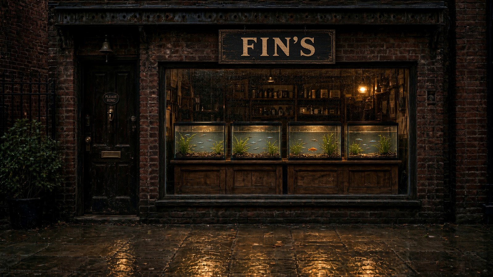
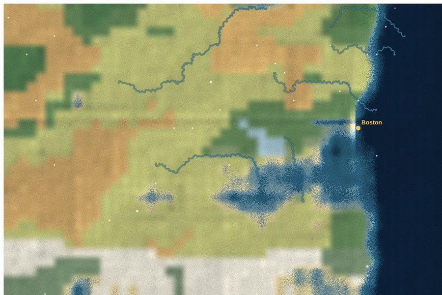
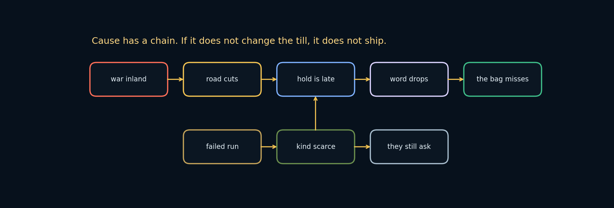
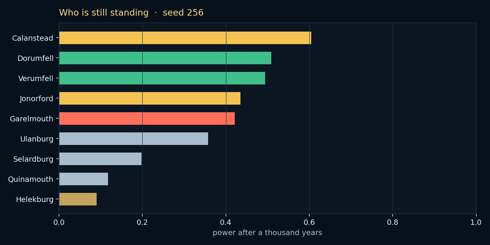
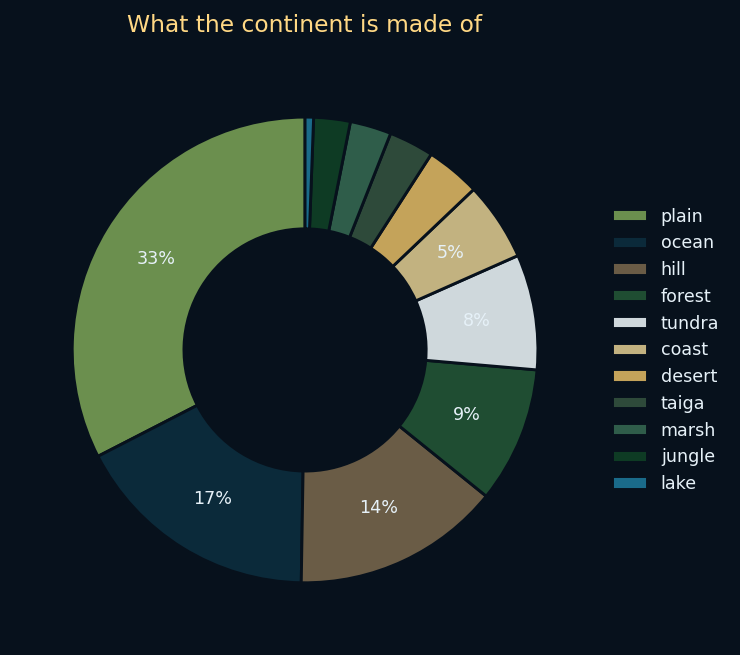
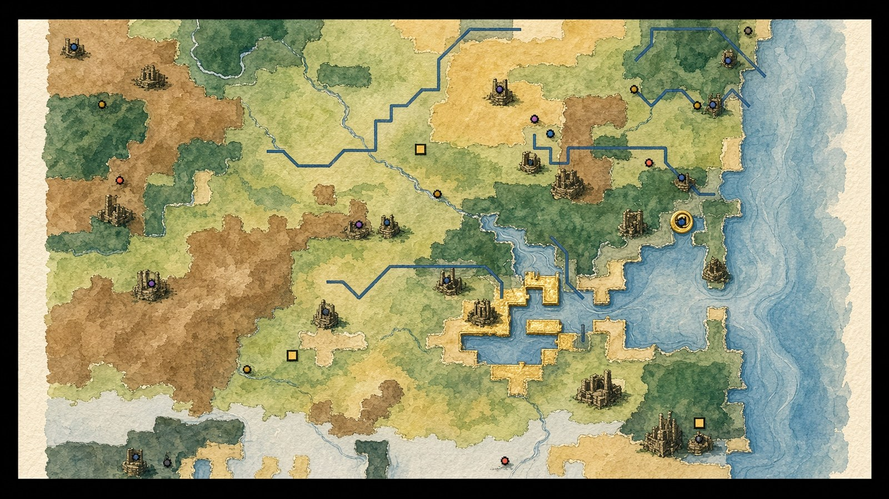

# Fin's

A harbor aquarium shop that keeps going after you look away.

<p align="center">
  
</p>

You open in Year 1000. The tanks are already running. People come in off the street for a fish, for change, for a look, or because they always walk this block at six. The till is a run. The floor is wet or it isn't. The record does not close.

```
              ·  ~    ~   ·
         ╔══════════════════════╗
         ║  .  ><>      ><{{{{º ║
         ║ ·   ≈   ><>     ≈  · ║
         ║  ──────────────────  ║
         ║        F I N ' S     ║
         ╚══════════╤═══════════╝
                    │
                 the till

         a shop. a street. a record.
```

Most idle games are a number that goes up while you are in another tab. Fin's is a room you can fail in. The water has a temperature. The baker on the next block remembers the last bag. A named fish will not sell if it is holding too still. A thousand years of people already lived on this street before you hung the sign, and they did not stop when the clock hit present day.

Public source. [Business Source License 1.1](LICENSE).

---

## Why this exists

The usual shop-and-wait games sell you a loop. Fin's sells you a morning.

They fall down in different places:

- **The pretty tank.** Water that sparkles. A meter. Nobody on the street has a name, and the floor cannot flood. You are watching a screensaver that pays.
- **The firm.** Staff bars, an upgrade tree, a graph of profit. The fish are SKUs. The city is a multiplier. Nothing in the room has weight.
- **The hold.** Deep, and the map is the world. There is no till. There is no one person waiting while you scrape algae. You tend a civ. You do not bag a pair at lunch.
- **The scripted counter.** Dialogue trees in a shop skin. No physics. The wet boards do not change whether they buy. The line is the game.

Fin's is the other object: a shop you can keep, on a street that notices, with water that has opinions, and a record that is still writing.

| | What you tend | What remembers you | What happens if you look away |
|---|---|---|---|
| Pretty tank | a meter | nothing | the number |
| Firm | a spreadsheet | a ledger | the quarter |
| Hold | a civ | a history dump | the season |
| Scripted counter | a scene | a flag | the next line |
| **Fin's** | this room | the baker, the fish, the year | the next customer |

---

## What you are actually keeping

### The tanks are not inventory

Every fish has a name, a pedigree, and a thought. Not a label on a stack. A mind: needs, mood, stress, a few memories it will not drop. Some of that mind is learned — a small net per fish, gated, attentive, willing to copy what the tank next to it is doing. A fish that is holding too still will not bag. You can have two goldfish and still have nothing to sell, because one of them is the last of a pair and the other is not well.

The pair rule is the whole first hour. Keep two adults of a kind. Sell one, and the walk-in who asked for that kind walks. Life writes it. The gold line under the name does not clear.

Water is chemistry, not a tint. Ammonia, a filter that packs, ich that is an outbreak and not a mood. Feed less if the cycle is climbing. Heat if the room is following a cold street. Winter will punish an unheated tank. The Calendar is not flavor.

### The building is a site

Sixteen by ten cells of heat, standing water, glass, oak, pressure. A leak is not a toast. It is a puddle. People will not step in it. The sale will not close. Floss dries the aisle. The filter packing is how the room turns people around at the door.

Outside the window the weather is doing something. Rain, fog, a hard sky, night. That air comes in. The room cools. Named fish notice. Odds change.

### The street is not a multiplier

A harbor block. People with jobs, walking because they live here, not because a spawn radius drew a circle around you. Some come in to buy. Some come in to look. Some come in because they always pass at six. The baker trusts you until the aisle is wet. A regular wanted a pair and you sold the last adult. They will say so next time.

You can type `/act` and do a thing in the street. The street heard it. Mood moves. That is not a cheat console that prints gold. It is a person doing something in a place that keeps witnesses.

### The till is a run

Two bags in a row is a temperature. Miss, and it breaks. Variable juice, not a loot table. There is no gacha. The unfinished line under the name is a Zeigarnik hook: something still small, wait. You can close the tab. The gold line will still be there.

Coins come from sales, orders, the odd curiosity. Bills do not wait. Selling the last of a pair to make rent is how the till stays quiet tomorrow. Harbor Supply dates the bottles to the millennial clock. Pads pack. Cubes thaw. Conditioner from Revere, floss from Chelsea, leaves dried in Lynn. Stock is not a shop tab of +5% buttons. It is what a counter actually empties.

### The year did not stop

Present day is Year 1000. The atlas is not a locked book of flavor text. Historical figures still act. Facets inherit. Close blood has a cost — the record will let siblings marry, and the children can be sickly, or not arrive. Materials react: salt eats iron, oak rots, glass etches. A war on the far side of the water can raise the price of a word. You are not waiting for a credits screen. The clock does not cap at a real-world calendar year.

Life is a daybook. One page. What the keeper said, who came, what the floor did, the hour, the weather. Not five systems shouting.

### The book in the back

There is a Book of the Dead. There is a Necronomicon. You can read a name that should have stayed on the page. Raising it is not a skin. The shop mood moves. People leave. The chronicle dates the line. Year N. You did this.

The Guide is not a tip box. It is a live knowledge base: what is happening now, what to do if you are stuck, if you are bored, if you are only curious. It will tell you the pair rule again if you need it. It will not tell you a walkthrough of a game it is not.

### What is looking back

A difficulty director watches how you play — skill and calm, an ensemble that disagrees with itself on purpose. It does not hate you. It also does not flatten the room into a balanced tutorial. The water still packs. The baker still remembers.

```
  street ──► door ──► aisle ──► glass ──► till
    ▲          │         │         │        │
    │          │         wet       cold     bag
    └──────────┴─────────┴─────────┴────────┘
                     because
```

Weather cools the room. The room stresses the named fish. A stressed fish will not bag. A miss becomes a rumor. The rumor walks back in after lunch. That loop is the product.

---

## A morning

You open. Year 1000, a clear spring. The tanks have names in them. Someone is already on the gravel.

You click the water. You do not sell the last of a kind. Lunch comes. The baker is coming, for goldfish. You have two. The aisle is dry. The bag lands. The run ticks. The gold line moves.

Or: the filter packed overnight, the aisle is a dark ellipse on the boards, and they look and leave. Life writes it. The whisper does not cheer you. It tells you what is still unfinished.

That is deeper than a number going up. It is also slower, on purpose. If you wanted a counter that pays you for being away, this is the wrong counter.

---

## What is actually different

**Cause has a chain.** Idle games add systems as tabs. Fin's adds systems as reasons. If it does not change odds, speech, or the till, it does not ship.

**People are not traffic.** A walk-in is a conversation with a last visit. A miss is a sentence. Trust is a number that wet boards can cut.

**The fish are not SKUs.** Name, pedigree, thought, stress, a mind that learns. Sellable is a judgment, not a count.

**The atlas is a living record.** A thousand years behind you, and it is still simulating the figures. Present day is a year with a number.

**The run is honest.** Unfinished work, variable juice, a streak you can break. No boxes. No pity timer. No disguised slot.

**The building has physics.** Heat, water, flow, a puddle that is also a closed sign.

**You can do a thing.** `/act` is not god mode. It is a person on a street that already had opinions.

---

## The engines under the atlas

Boston is one port. Four more engines keep the rest of the continent:

<p align="center">
  
</p>

<p align="center"><sub>Seed 256. The Glass and Ash, Age of the Long Freeze. Gold ring is the harbor. The rest of the map does not pause when you hang the sign.</sub></p>

- **The realm.** Elevation, rain, heat, drainage, volcanism, savagery. Biomes, rivers, civilizations with a tongue and an ethic, sites, gods, wars, a thousand years of figures. @ on the map is the shop.
- **The ground.** Soil, stone, three caverns, magma. Veins that dry when a mine is sacked. If the boards run warm, that is not the weather.
- **The living water.** Populations inland, not in your glass. A failed run makes a kind scarce on the counter. People still ask. They just do not buy.
- **The roads.** Every site keeps a nearest road. A war cuts the ones that touch the harbor. Holds come late. Someone walks in who started in a town you have only read.
- **The tongue.** Each people has a phonology. Names in the Atlas were said that way. A traveler on Salem still speaks English, and then a word that is not.
- **The beasts.** Unique bodies, a hunger, a year they wake. When one circles the harbor, the till feels it. The name goes in the book.
- **The old names.** Seven gods, a day in the twenty-eight, a fish that is holy that week. Sell it and the street is easier.
- **Rumour.** A fact that walks. Heat, a source, a line on the floor before it is a number.

<p align="center">
  
</p>

<p align="center">
  
  &nbsp;
  
</p>

<p align="center">
  
</p>

A war inland is not flavor. Word drops. Odds drop. The till feels it.

---

## Three ways to play

**In a tab.** Serve `game/` and open `index.html`. Same shop.

**As a window.** Chromium without the browser chrome. No tab sleeping. F11 is fullscreen. Mac, Windows, Linux — one source, three packages.

```bash
git clone https://github.com/SharpMeow/Fins.git
cd Fins
npm install
npm start
```

**As a download.** GitHub Actions builds the installers. Run the **desktop** workflow, or push a tag `v1.0.0`.

| Machine | What you get |
|---|---|
| Mac | `.dmg` (unsigned — right-click, Open, the first time). The window still says Fin's. |
| Windows | installer `.exe`, or a portable `.exe` |
| Linux | `.AppImage` |

The shop inside is the same `game/` folder the tab uses. A window spends more pixels and will not put the tab to sleep. WebGL2 water, ridged caustics, Schlick glass, bloom on the hood lamps. The room is the renderer.

Click the water to feed. Click the filter when it sours. Keep two of a kind if you mean to sell. The rest of the shop is waiting on that.

| | |
|---|---|
| Tank / Shop / Map | the three rooms |
| Life | the daybook |
| Guide | when you are stuck, bored, or curious |
| `/act` | you did a thing. the street heard it |

---

## For people (and agents) in this repo

Fin's is a game you serve from a folder, not a package you install into something else.

**Use it when** the work is this shop: the water, the street, the daybook, the run. When a change has to show up in play — odds, speech, a wet floor — not in a tab that nobody opens.

**Leave it when** you want a generic tycoon kit or a Store listing. The source is public. The license is not a free-for-all.

If you are an agent:

1. Play it before you patch it. The gold line, the pair rule, the puddle.
2. Do not flatten the shop into a sim you cannot walk.
3. Do not invent a second HUD. The strip at the top is already too willing to wrap.
4. A toast that fires on continue without a bag is a bug. The run starts this session.
5. Keep the name Fin's. The shopkeeper is not the sign.
6. The source is BSL. Do not relicense it as MIT. Do not publish the art as a starter kit.

---

## License

[Business Source License 1.1](LICENSE).

Play it. Study it. Keep a copy.

Do not sell the source, and do not ship Fin's as a competing shop. On 17 September 2030 this version becomes Apache 2.0.

Built by Chaos.

<!--
the pages are not a file you sell.
open the back room. read a name that should have stayed written.
seed 256 reprints The Glass and Ash.
the shop is late. Year 0 was not empty.
docs/the-pages.md
-->

